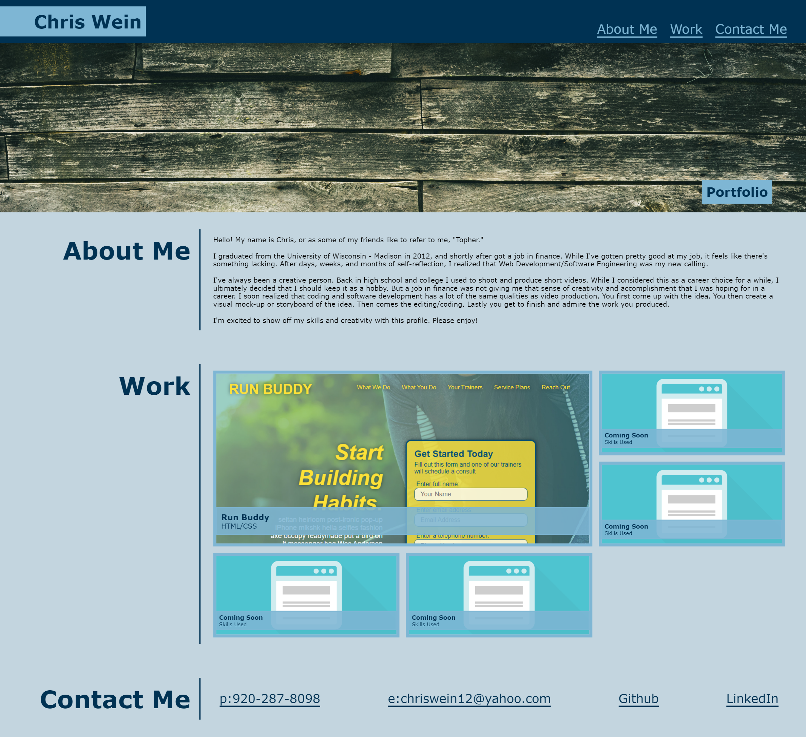
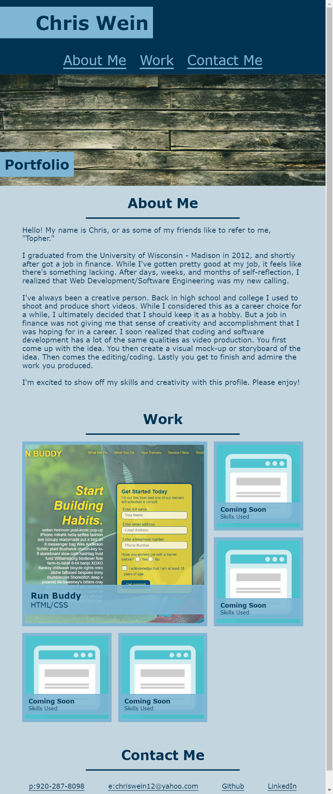
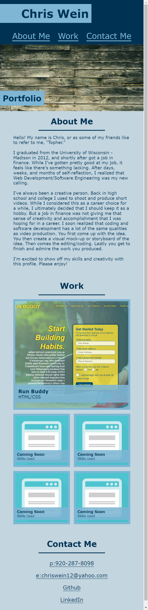

# Profile -  A Personal Profile Website for Chris Wein

## Description of the site
This website is a personal website designed to show off my work over the coming months and years.

 

## Sections of the Website
* "About Me" section that gives a brief description of who I am.
* "Work" section that features my current work. This will be updated with new work as time goes on. For now, I have placed placeholder images and text in the empty sections.
* "Contact Info" section that gives my phone, email, github, and linked in pages, all with clickable links.

 

## Website Features
* Nav bar navigation
* Tablet and mobile readiness.
* Links to outside websites.

 

## Link to My Personal Profile Website
https://chriswein12.github.io/Profile/

 

## How the Website Looks on a Desktop/Laptop Montitor

 

## How the Website Looks on a Tablet

 

## How the Website Looks on a Mobile Phone

## Credits

*- Project completed by Chris Wein*